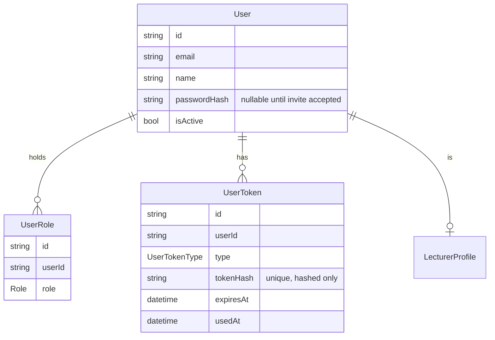
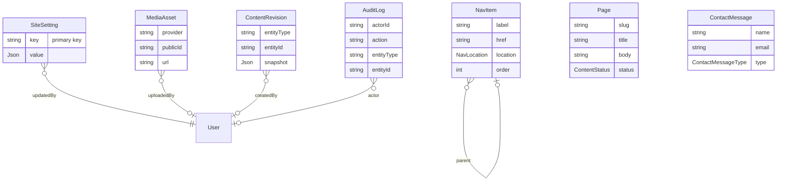
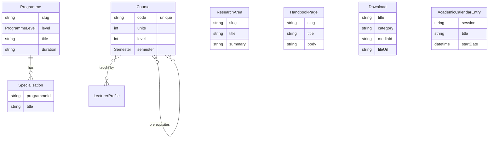
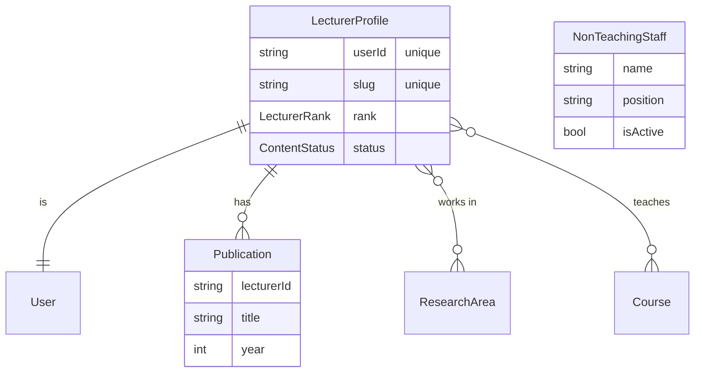
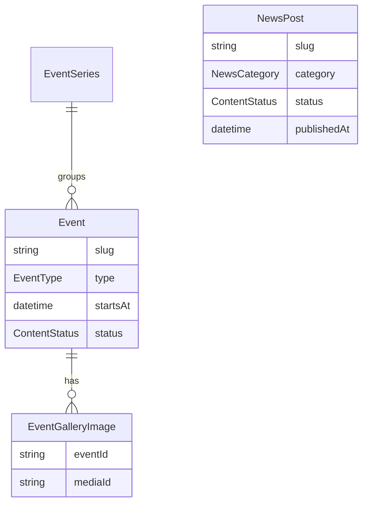
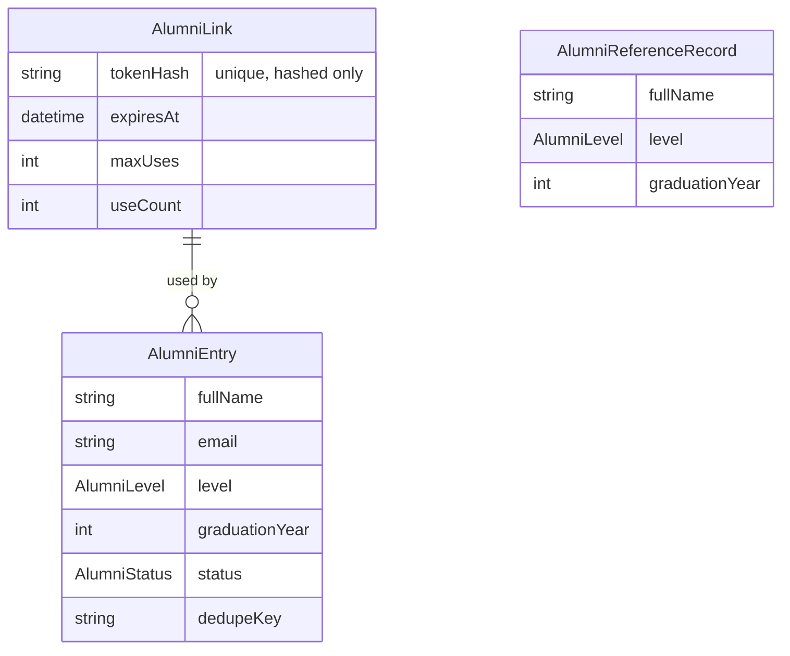
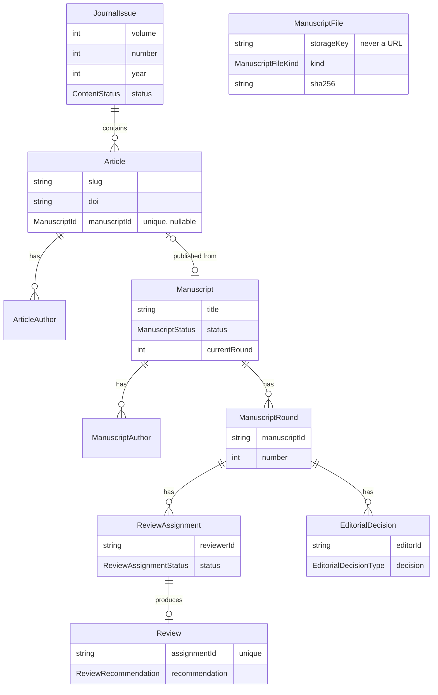

# Data model

This records the Prisma schema built in Stage 02 ([prisma/schema.prisma](../prisma/schema.prisma)). It is a reference, not a tutorial: read [docs/SCOPE.md](SCOPE.md) for why each module exists.

## Users and access

- **User**: one row per account. No role column; `passwordHash` is null until an invite is accepted (Stage 03).
- **UserRole**: a user can hold several roles at once; `(userId, role)` is unique.
- **UserToken**: invite and password-reset tokens. Only a hash is ever stored.

There are no Auth.js `Account`, `Session`, or `VerificationToken` tables (decision #13): Auth.js runs the Credentials provider with JWT sessions, and `User`/`UserRole`/`UserToken` are the entire account model.

## Site content

- **SiteSetting**: key/value store (key is the primary key, not a cuid) for the HOD address, hero copy, stats, contacts, social links, footer text. Seeded with `[SAMPLE]`-marked placeholders until the department supplies real content.
- **NavItem**: header/footer menu, self-referencing for sub-items.
- **Page**: freeform pages (About, History, Mission).
- **MediaAsset**: every image reference in the schema points here, never to a raw URL string.
- **ContentRevision**: a JSON snapshot per edit, for rollback.
- **AuditLog**: who changed what. `actorId` is `Restrict` on delete so a user can never be removed while they still have log entries attributing changes to them.
- **ContactMessage**: the routed enquiry form.

## Academics

- **Programme / Specialisation**: B.Sc., M.Sc., Ph.D., each with specialisations.
- **ResearchArea**: the nine subject areas, each optionally illustrated via `MediaAsset`.
- **Course**: `code` is unique; prerequisites are a directional self many-to-many (`_CoursePrerequisite`); teaching lecturers are a many-to-many with `LecturerProfile` (`_CourseLecturer`).
- **HandbookPage**: self-referencing tree of handbook content.
- **Download**: a file either referenced through `MediaAsset` or (for files not run through the Cloudinary pipeline) a raw `fileUrl`/`filePublicId` pair.
- **AcademicCalendarEntry**: dated calendar items.

## People

- **LecturerProfile**: one per `User`; the admin-created half (`userId`, `rank`) exists before the lecturer's invite is accepted, the rest (`bio`, `officeHours`, etc.) is theirs to complete.
- **Publication**: a lecturer's selected publications, cascades with the profile.
- **NonTeachingStaff**: listing cards, no login, no `User` relation.

## News and events

- **NewsPost**: `status` + `publishedAt` drive the public listing; `authorId` is `SetNull` so removing a staff account never deletes their posts.
- **EventSeries / Event**: events optionally belong to a recurring series; upcoming/past is computed from `startsAt`, not stored.
- **EventGalleryImage**: past-event photo gallery, cascades with the event.

## Alumni

- **AlumniLink**: one-time or per-cohort form links; only a hash of the token is stored.
- **AlumniEntry**: a submission, `PENDING` until an admin approves or rejects it. `dedupeKey` (normalised name + graduation year) is indexed but intentionally **not** unique, since duplicate detection is a review aid, not a hard block.
- **AlumniReferenceRecord**: the private 519-name cross-check list. No relation to `AlumniEntry`, no public exposure anywhere in the schema.

## Journal

- **JournalIssue / Article**: the public side. `(volume, number)` is unique per issue. Deleting an issue is `Restrict` while it still has articles, since a published article's place in the record is not disposable the way draft content is.
- **ArticleAuthor**: byline entries; `userId` is optional and `SetNull`, since a byline survives even if the matching account is removed.
- **Manuscript / ManuscriptRound / ManuscriptFile**: the private submission-and-review side. `ManuscriptFile.storageKey` is a path inside `PRIVATE_STORAGE_DIR`, never a URL.
- **ReviewAssignment / Review**: one review per assignment (`assignmentId` unique); `(manuscriptId, roundId, reviewerId)` is unique so a reviewer cannot be double-assigned to the same round.
- **EditorialDecision**: the editor's call for a round. `editorId` is `Restrict`, same reasoning as `ReviewAssignment.reviewerId`: the record of who decided what must survive even if that editor's account is later removed.
- Reviewer identity is a query-layer concern (blind review), not a schema one: nothing here prevents a service from selecting `Review` without its `assignment.reviewer` relation when building an author-facing response.

## Public-safe fields

Nothing below is enforced by the schema; it is the contract Stage 03+ query services must honor when building any response a public, unauthenticated visitor can see.

**Never public, under any circumstance:**

- `User.passwordHash`, every `UserToken.tokenHash`, `AlumniLink.tokenHash`
- `AlumniEntry.email`, `.city`, `.country` beyond what the directory filters need (the directory is filterable by year/level/country/industry, not a lookup by name-to-email)
- All of `AlumniReferenceRecord` (every field) — admin-only, never rendered on any public route
- All of `Manuscript`, `ManuscriptAuthor`, `ManuscriptRound`, `ManuscriptFile`, `ReviewAssignment`, `Review`, `EditorialDecision` — the entire submission-and-review workflow is private to authors, reviewers and editors; reviewer identity is additionally hidden from authors even inside the authenticated workflow
- `ContactMessage` (all fields) — admin-only inbox
- `AuditLog` (all fields) — admin-only
- `SiteSetting`, `ContentRevision` raw rows — admins read/write these directly; public pages read the *rendered* content they produce, not these tables

**Public once status allows it** (i.e. selectable when `status = PUBLISHED`, or always for models with no status field that are inherently public):

- `Page`, `Programme`, `Specialisation`, `ResearchArea`, `Course`, `HandbookPage`, `Download`, `AcademicCalendarEntry`
- `LecturerProfile` — all fields except none; `publicEmail` is deliberately named so the portfolio can show a contact address distinct from the account's private login `email` on `User`
- `NonTeachingStaff`
- `NewsPost`, `EventSeries`, `Event`, `EventGalleryImage`
- `AlumniEntry` — only once `status = APPROVED`, and only the directory-facing fields (`fullName`, `level`, `graduationYear`, `organisation`, `roleTitle`, `city`, `country`, `industry`, `photo`, `linkedinUrl`, `isFeatured`); never `email`, `consentAt`, `consentVersion`, `rejectionReason`, `reviewedById`, `reviewedAt`, `dedupeKey`
- `JournalIssue`, `Article`, `ArticleAuthor`, `EditorialBoardMember` — once `status = PUBLISHED` (issues/articles) or `isActive = true` (board members)
- `MediaAsset` — the rendering fields (`url`, `width`, `height`, `alt`); `uploadedById` is not public
